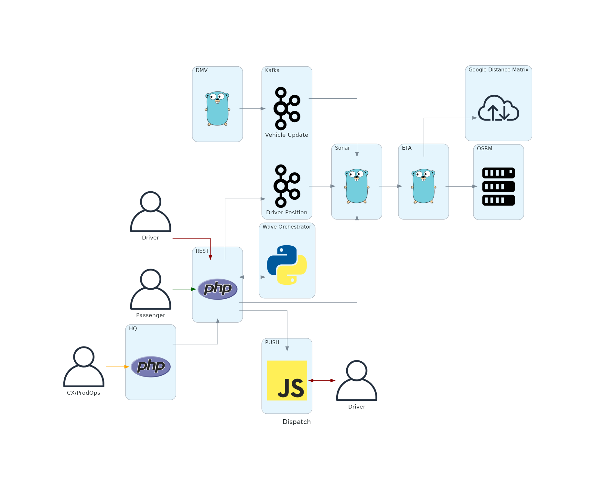

<!-- Space: DT -->
<!-- Title: Current Architecture -->
<!-- Parent: Engineering -->
<!-- Attachment: img/dispatch.png -->

# Current Architecture

## Passenger

The passenger looking for a ride.

## Driver

The driver that works with us in order to make a ride.

## CX/Product Ops

Customer experience and Product Operations are the primary users of HQ.

## REST

[REST](https://github.com/taxibeat/rest/) handles the request for a ride form a passenger and tries to use all other services to find the best suited driver, get in contact with him and handles the responses from the driver in order to create a ride.

## HQ

[HQ](https://github.com/taxibeat/hq) is the back office tool that is used to configure dispatch settings and to provide data for support.

## Push

[PUSH](https://github.com/taxibeat/push) is responsible to maintain a connection with the drivers in order to send and receive data like requests for a ride.

## Wave Orchestrator

The [wave orchestrator](https://github.com/taxibeat/wave-orchestrator) was responsible for creating waves when using older dispatch methods. The only use now is to support search for a driver after the dispatched driver cancels the ride.

## Kafka

### Driver Position

The topic contains the driver position along with other driver data that have been added in REST.

### Vehicle Update

The [DMV](https://github.com/taxibeat/dmv) service send the vehicle update which contains the services that the vehicle supports.

## Sonar

[Sonar](https://github.com/taxibeat/sonar/) is responsible to find drivers with certain criteria in a geographic region.

## ETA

The [ETA](https://github.com/taxibeat/eta/) service is responsible for calculating the ETA of multiple drivers to a specific passenger. The service actually call's Google distance Matrix and has OSRM as a fallback.

## OSRM

[OSRM](https://github.com/taxibeat/osrm/) is a project that uses the actual [OSS OSRM Project](http://project-osrm.org/) by providing all the configuration and deployment tools for adding it to our stack.
